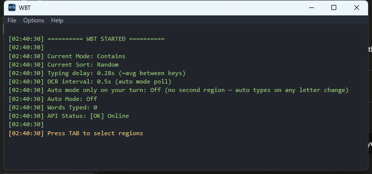

# Word Bomb Tool — C# / WPF

[](LICENSE)
[](https://dotnet.microsoft.com/download/dotnet/8.0)
[](#requirements)

A screen-region OCR assistant for Discord's "Word Bomb" minigame: it reads the
letters on screen, fetches matching word suggestions from the [Datamuse
API](https://api.datamuse.com/words), and auto-types them for you.

> ### 🧬 Origin
> This is a from-scratch **C# / WPF (.NET 8)** rewrite of
> **[mPhpMaster/word-bomb-tool](https://github.com/mPhpMaster/word-bomb-tool)**,
> the original Python implementation (Tkinter UI, `pystray` tray icon,
> `keyboard` for hotkeys, `pytesseract` + `mss` for OCR/capture). This repo
> ports that project's logic and feature set to C#/WPF — same hotkeys, same
> OCR pipeline, same config file format, different runtime. All credit for
> the original concept, design, and implementation goes to that project;
> please go star/support it too.

## Screenshot



*The main log window on startup — colored log lines (green for info, yellow
for prompts), current search/sort mode, typing delay, and OCR poll interval.*

## Features

- **Screen-region OCR** — reads letters from a user-selected screen region
  (Tesseract, with an adaptive preprocessing pipeline: grayscale →
  autocontrast → upscale → Otsu threshold → auto-invert → pad).
- **Word suggestions** via the Datamuse API, with 5 search modes (Starts
  With, Ends With, Contains, Rhymes, Related Words) and 4 sort modes
  (Shortest, Longest, Random, Frequency).
- **Auto-typing** of suggestions into the game via synthetic keystrokes, with
  human-like timing.
- **Global hotkeys** — works regardless of which window has focus.
- **Region overlays** — a visible border around the selected screen region.
- **System tray integration** — minimize to tray, quick actions from the
  tray menu.
- **A GUI-less CLI** (`WordBombCLI.exe`) for `suggest` / `define` / `modes`
  without the OCR/hotkey machinery, useful for scripting or quick lookups.

## Requirements

- Windows 10/11 (x64). The app is Windows-only — it depends on the Win32
  keyboard hook and `SendInput` APIs.
- [Tesseract OCR](https://github.com/tesseract-ocr/tesseract) for text
  recognition. The app offers to download and install it automatically on
  first run if it's missing.
- **To build from source:** the [.NET 8 SDK](https://dotnet.microsoft.com/download/dotnet/8.0).
- **To just run it:** nothing else — the self-contained builds and the
  installer bundle the .NET runtime. (A smaller framework-dependent build is
  also available; see [Publishing](#publishing).)

## Installation

**Easiest:** grab `WordBombTool-Setup.exe` from the
[Releases](../../releases) page and run it. It installs the app, adds Start
Menu / optional desktop shortcuts, an optional "add CLI to PATH" task, and a
clean uninstaller — no admin rights or separate runtime install required.

**From source:** see [Building](#building-and-testing) below.

## Hotkeys

| Key | Action |
|-----|--------|
| `TAB` | Select a new screen region |
| `SHIFT` | Fetch suggestions for the current letters |
| `F1` | Toggle auto mode (continuously monitor the region) |
| `Alt+1` | Fetch definitions for the current word |
| `Page Up` | Change search mode |
| `Page Down` | Change sort mode |
| `Delete` | Clear typed history |
| `Ctrl+Z` | Undo the last typed word |
| `Caps Lock` | Show/hide the log window and region outline |
| `.` (period) | Show/hide the help window |
| `Ctrl+C` | Exit the program |

## How it works

1. Press `TAB` and drag-select the box that shows the game's letters.
2. Press `SHIFT` to fetch a suggestion, or `F1` to let it auto-detect and
   auto-type as the letters change.
3. The app waits for the game to ask for a word (or for you to press
   `SHIFT`/`F1` again) before repeating.

## Project layout

```
word-bomb-tool-cs/
├── WordBombTool.sln
├── publish.ps1                    # builds/tests/publishes all variants
├── installer/
│   └── WordBombTool.iss           # Inno Setup installer script
└── src/
    ├── WordBombTool.Core/         # shared logic: config, Datamuse client,
    │                              # suggestion sort/pick, OCR preprocessing
    │                              # (net8.0, no WPF/WinForms/Win32 deps)
    ├── WordBombGui/                # the desktop app (net8.0-windows, WPF)
    ├── WordBombCli/                # the GUI-less CLI (net8.0, console)
    └── WordBombTool.Tests/         # xUnit unit tests
```

## Building and testing

```powershell
git clone https://github.com/mPhpMaster/word-bomb-tool-cs.git
cd word-bomb-tool-cs
dotnet build .\WordBombTool.sln -c Release
dotnet test .\src\WordBombTool.Tests\WordBombTool.Tests.csproj -c Release
```

## Publishing

`publish.ps1` builds, tests, and publishes every distributable variant into
`dist\`:

```powershell
.\publish.ps1                              # all 3 variants, GUI + CLI
.\publish.ps1 -SkipTests                   # skip tests for a faster loop
.\publish.ps1 -Variant SelfContainedR2R    # just one variant
```

| Profile | GUI size | Needs .NET 8 installed? | Notes |
|---|---|---|---|
| `SelfContainedSingleFile` | ~154 MB | No | Bundles the whole runtime. |
| `SelfContainedR2R` | ~170 MB | No | Adds ReadyToRun precompilation — faster cold start. **Used by the installer.** |
| `FrameworkDependent` | <1 MB | Yes ([.NET 8 Desktop Runtime](https://dotnet.microsoft.com/download/dotnet/8.0)) | Smallest download, for machines that already have the runtime. |

### Building the installer

Requires [Inno Setup 6](https://jrsoftware.org/isinfo.php)
(`winget install JRSoftware.InnoSetup`):

```powershell
.\publish.ps1 -Variant SelfContainedR2R
& "C:\Program Files (x86)\Inno Setup 6\ISCC.exe" installer\WordBombTool.iss
```

Output: `dist\installer\WordBombTool-Setup.exe`.

## Configuration files

Written next to the running executable (same format/filenames as the
original Python and Go versions, so `ocr_config.json` carries over between
them):

- `ocr_config.json` — last selected region, current search/sort modes,
  typing delay, OCR poll interval.
- `ocr_metrics.json` — OCR success rate, API response times, session stats.
- `ocr_helper.log` — application log.

## Notable differences from the original Python version

- **GUI toolkit**: WPF instead of Tkinter. The tray icon uses
  `System.Windows.Forms.NotifyIcon` (WPF has no native tray API).
- **Hotkeys/typing**: a native Win32 low-level keyboard hook and `SendInput`
  instead of the `keyboard` package.
- **OCR**: the same Tesseract-based pipeline (preprocessing, 4-PSM
  majority-vote strategy), called via a managed process instead of
  `pytesseract`.
- **Distribution**: self-contained single-file executables and a proper
  Windows installer, instead of PyInstaller `.exe`s.
- Everything else — hotkey bindings, config file format, search/sort modes,
  the overall UX — is intentionally kept identical to the original so it's a
  drop-in replacement.

## Contributing

Contributions are welcome — see [CONTRIBUTING.md](CONTRIBUTING.md).

## Disclaimer

This is for educational purposes. Use responsibly and check the relevant
game/platform's terms of service.

## License

MIT — see [LICENSE](LICENSE) for details.

## Credits

- **[mPhpMaster/word-bomb-tool](https://github.com/mPhpMaster/word-bomb-tool)** —
  the original Python implementation this project is a port of.
- **[Datamuse API](https://www.datamuse.com/api/)** — word suggestions and
  definitions.
- **[Tesseract OCR](https://github.com/tesseract-ocr/tesseract)** — text
  recognition.
